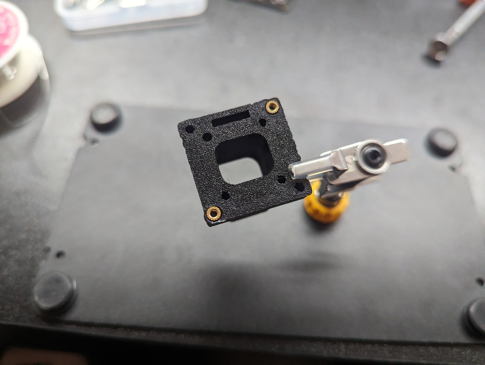

# Open CAN Bus Hub CAD Model

The following is intended to help with usage and modification of the parametric CAN hub 3D model. 

## What Do I Need? 

You will need Fusion 360 and some mild CAD skills. The hard work of the model should be done for you, you just need to add mounting to fit your needs. If you are new to CAD then read the FAQ below to learn more. 

## Design Instructions: 
1. Make sure Fusion 360 is installed on your computer. 
2. Download the can_hub_parametric_model.f3d from this folder onto your computer. 
3. Open Fusion 360 
4. Click File -> Open

5. Click the Open From My Computer button

6. Navigate to the can_hub_parametric_model.f3d file and select it 
7. Under MODIFY press the Change Parameters button

8. Under this menu you will find 3 parameters that you may want to change. They are described below. Once you change any of these Fusion will redraw the model. This may take some time depending on the speed of your machine. 

    **row:** The number of rows of plugs you want.

    **col:** The number of columns of plugs you want. Note that PCBs are designed so that they are soldered in the column direction. Meaning you should plan to have more columns than rows. 

    **plugScale:** Scale of the plug. If your printer doesn't print internals accurately this is a way to fine tune that without throwing off other dimensions. 

**The following two steps are optional, but highly recommended.**

9. Create a mount. There are no mounts in the parametric model and you will likely need a way to mount these in your car. It is up to you to add a mount to the model from here 
10. Add extra bolts between top and bottom. If you look at the model there are 4 bolts holding it together. If you have a very large box you will likely experience some gaps between the two pieces without bolts in the middle. These are left out because it's too ambiguous to parametrically decide when and where to add the extra bolts. 
11. To save the models for printing find them in the Navigation -> Bodies folder, right click, hit Save as Mesh, press OK on the next menu, select where to save the file to and hit Save. You will need to do this for both the top and bottom pieces. 

## Assembly Instructions: 
1. Melt the M3 threaded inserts into the top piece. These will be in each of the four corners plus any you may have added in the design process. 
2. Melt a minimum of two inserts into the top piece where the PCB will attach. If you only do two make sure they are diagonal from each other.

3. Repeat steps 1 and 2 for every plug in your hub. 

## Tips: 
1. I would suggest opening the Bodies -> Bits and Pieces folder and printing the single top piece to test with your plugs before printing the full model. Some printers aren't as dimensionally accurate as others. If the recepticle is too small or too large try adjusting the plugScale parameter until it fits properly. 

## Notes: 
1. The bottom body is not called bottom. It will likely be called Body648 in your version. This will be corrected in the future. 
2. The top body will have some numbers after Top in parenthesis. This is from the pattern tool. I had some issues with renaming it in the past so it has been stuck with this name. This may be corrected in the future. 