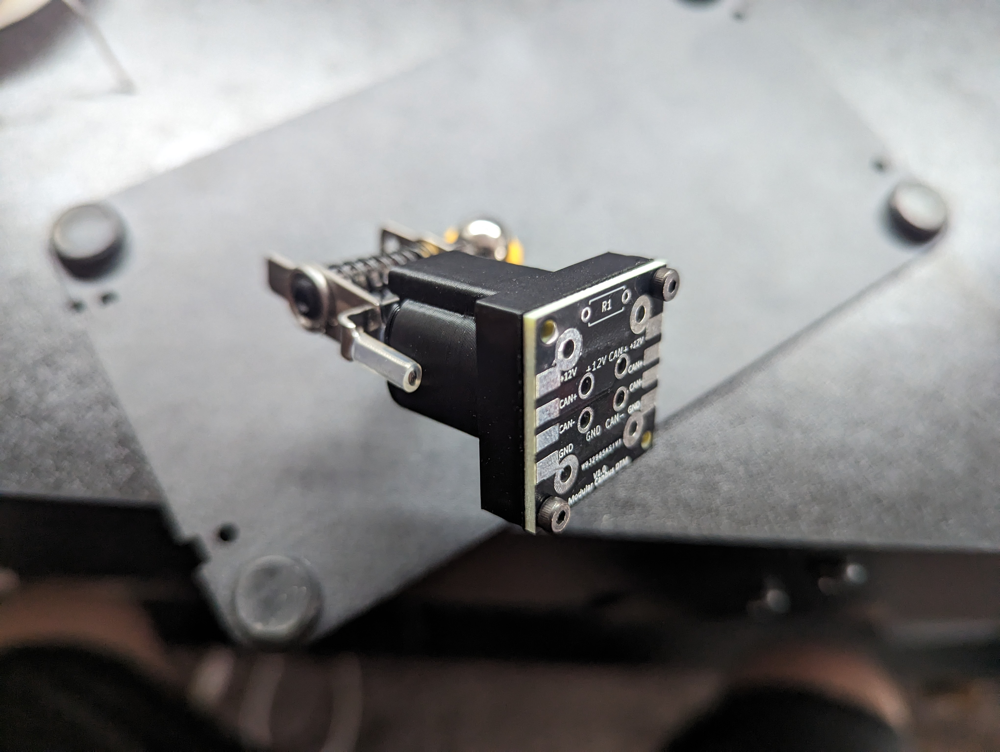
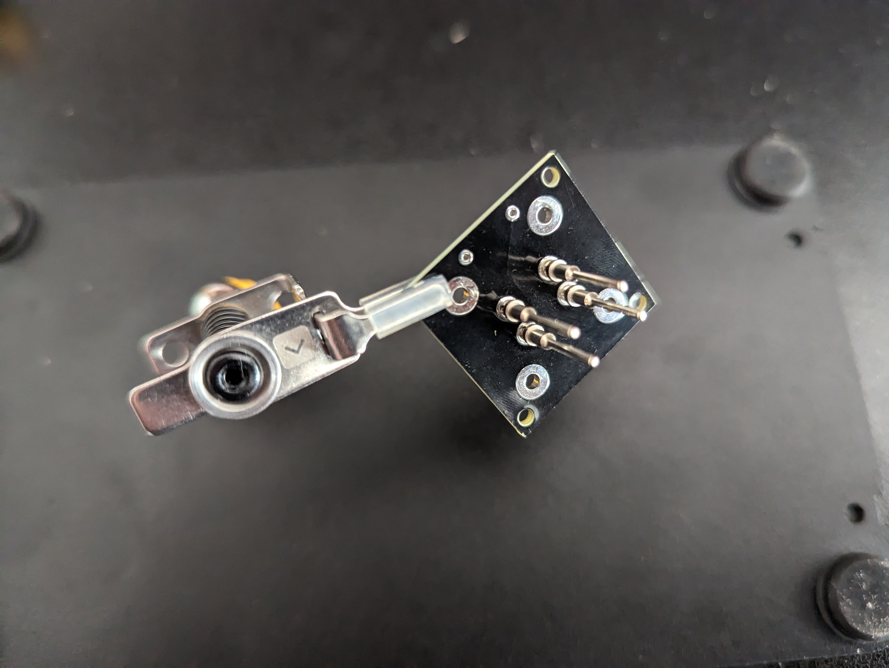

# Open CAN Bus Hub PCB

The following is intended to help with ordering and assembly of the PCB.

## What Do I Need?

If you plan to modify the PCB or order it from somewhere other than PCBWay you will need KiCad 9.0 or newer.

## Ordering:

If you are in the US and looking to place a small order, feel free to contact me as I might have some that I can ship out. Small batch orders of PCBs are generally much more expensive per board than bulk orders.

### PCBWay:

The design has been shared on PCBWay and can be ordered [here](https://www.pcbway.com/project/shareproject/Open_CAN_Bus_Hub_V1_0_372ae918.html). My suggestion would be to set the edge connector field to "No" versus the default "Yes". If you do not, it is likely PCBWay will contact you to ask you some details about the edge connection. This is not a normal edge connection and can be handled as a solder pad during manufacturing. From there the rest can be default or any other option you may want.

### Other Manufacturers:

1. Open KiCad
2. Press File -> Open Project and select the DTM4CanbusPCB.kicad_pro file from this folder
3. Double click to open the DTM4CanbusPCB-Board.kicad_pcb file
   
4. Press File -> Fabrication Outputs->Gerbers (.gbr)...
   
5. Press Plot in the bottom right
6. Press Generate Drill Files... then press Generate on the next menu
7. Open the newly generated PCB\Gerber folder and zip all of these files up
8. Upload this zip to your favorite PCB manufacturer and place an order.

### Important Notes:

- When ordering it is recommended to use 2oz Cu or heavier for the finished copper. The more plugs in your hub the heavier you will want. Small hubs may be fine with 1oz, but please do research for your use case.

## Assembly Instructions:

1. Bolt each PCB to the top piece of the hub with the M2 bolts. Make sure the resistor is closest to the clip on the plug as shown below. The text on the PCB should be pointed away from the plug.
   
2. Using needle nose pliars insert the DTM pins into the holes on the PCB through the plug.
3. Take a male DTM plug, with the pins in it, and insert it into the female portion of the plug making sure that all of your pins go into the pins on the male plug. You can gently push on the back of your pins to feel for resistance to make sure they are properly aligned and inserted.
4. Solder the pins to the PCB. Make sure you do not heat the pins up too much and melt the housing of your male plug.
   
   
