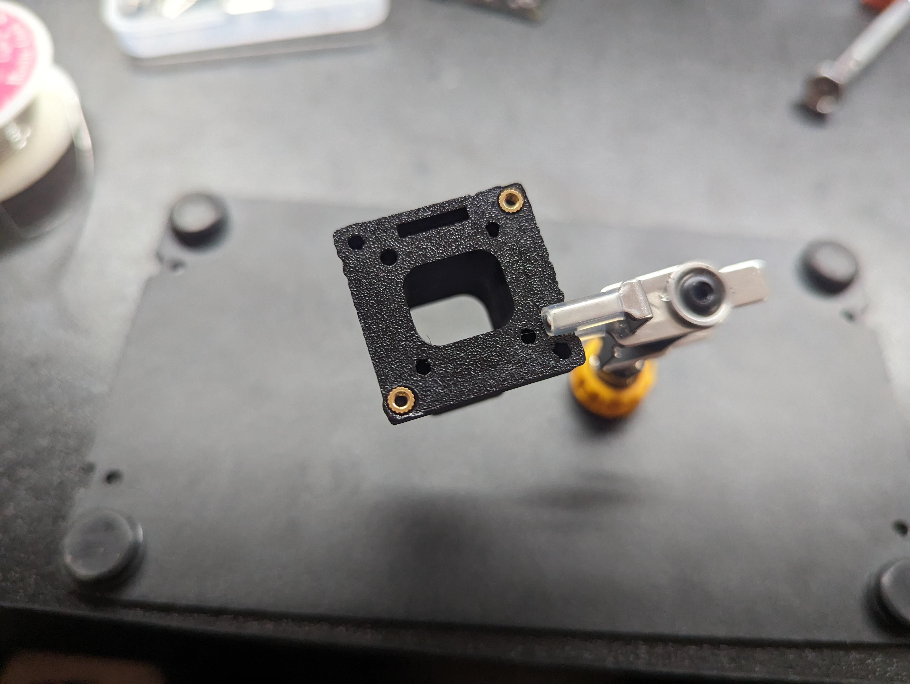
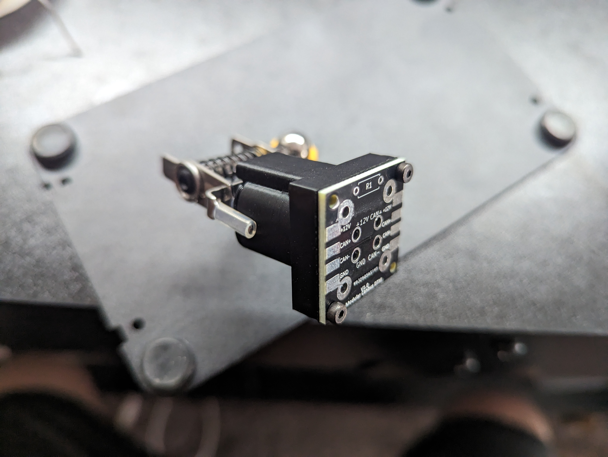
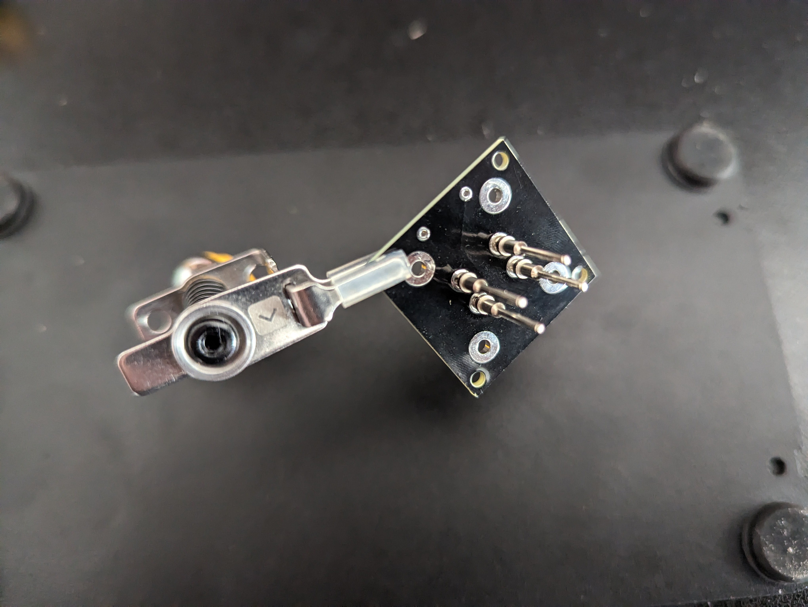
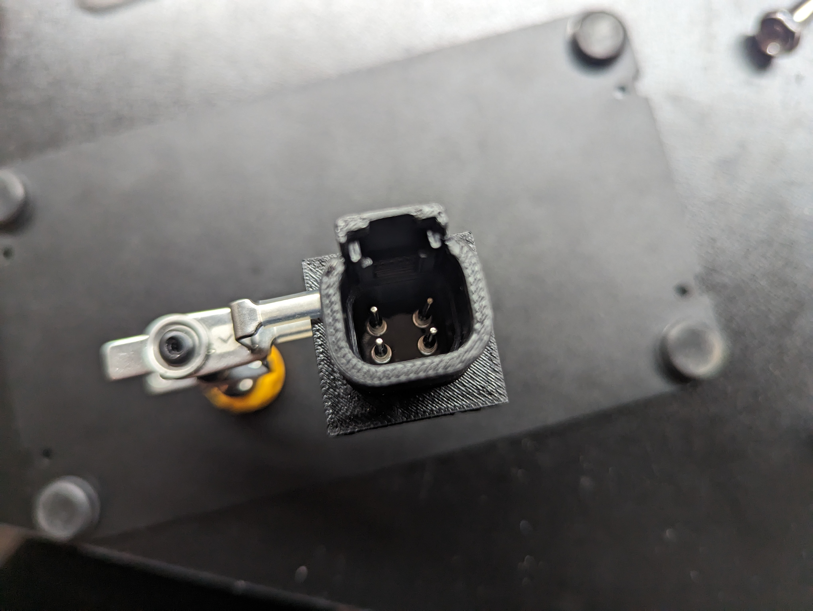

# Open CAN Bus Hub
An open source alternative to a CAN bus hub primarily used in aftermarket automotive industry. 

## Overview
This project is intended to reduce the cost of a simple part needed for many project cars. If you are building a car and need to add aftermarket equipment via CAN bus you will likely need a hub of some sort to distribute the network to each of your devices. 

The existing products like [AEM](https://www.aemelectronics.com/products/ev_conversions/wiring_shop/wiring_harnesses/parts/30-2225?srsltid=AfmBOopf-43udBTczr3DMtdVAqn7zBDi4FWJSfJJbkCLwWn_8UP-PhpX), [Haltech](https://www.haltech.com/product/ht-159000-elite-can-hub-4-port-dtm-4/?srsltid=AfmBOop2I1wcCl7ELiAaJ4Hz_9G2S5Ku90I_iyAMGlEmO2NZ8aU0mGMG), and [CANChecked](https://trailbrake.com/canchecked-cbd08-bus-hub/?srsltid=AfmBOopn7O5V_E_J0bepSbhidaalyBVMSegGgtooptUzHmF67YKdkKrH) are very expensive, are limited to a few devices after connecting the ECU, and often require external resistor termination. This project addresses these issues. 

This project will walk you through building your own CAN bus hub to meet your needs. 

## Design Notes 
* The industry standard for automotive CAN bus has become DTM plugs, so utilizing these was a priority
* Minimizing the number of wires to keep complexity and risk of issues was the primary priority. Later versions may attempt to eliminate the need for any wires regardless of number of rows. 
* Handling high(ish) current was something we regarded as important as users may be powering many devices from one hub. See the important section for more info on power capabilities. 

## IMPORTANT
* Do not exceed 10 amps total on the hub. This means all of your plugs combined should not exceed 10 amps. It would be ideal to put a fuse prior to the hub to ensure this is not exceeded. Read the PCB readme for more information on amperage. 
* Do not exceed 7 amps total on each of the plugs. The DTM pins are only capable of 7 amps and so is the PCB. Read the PCB readme for more information on amperage. 
* This design does not support the DTM waterproof gasket that comes with standard DTM plugs. This is partly due to the high cost of the gasket ($4 each) and partly due to the added complexity for 3D printing. Due to this is it not recommended to use this design in an area that will see direct contact with water or particulates that can cause electrical problems. 

## Tools Needed 

Note: All Amazon links below are just to serve as an example of what you are looking for. These can be substituted with any equivalent tool. 

| **Tool** | **Details** | **Link** | 
|----------|-------------|----------|
| Soldering Iron | Any will do, but a pointed tip is helpful | https://amzn.to/42WFt6c |
| 3D Printer | Read the FAQ if you do not have one. |  |
| Allen Keys | They'll often send some with bolts. | https://amzn.to/4j0mix5 |
| Needle Nose Pliars | These are not required, but make assembly easier. | https://amzn.to/3GLlzma | 
| Wire Strippers | Only needed if doing more than one row. | https://amzn.to/4kl7wSS |

## Parts Needed

Note: All Amazon links below are just to serve as an example of what you are looking for. These can be substituted with any equivalent part. 

| **Part** | **Details** | **Link** | 
|----------|-------------|----------|
| Solder   | Pretty much any basic solder for electronics should work well. | https://amzn.to/4mdSlfK |
| Filament | I recommend ASA | https://amzn.to/44zXtVi |
| DTM Pins | PN: 0460-202-20141 | https://www.te.com/en/product-0460-202-20141.html |
| M2 Bolts | M2x4mm socket cap | https://amzn.to/3GLZ6FB | 
| M3 Bolts | M3x12mm flat cap | https://amzn.to/3GRSxkQ |
| M2 Threaded Inserts | M2x3.2mmx4mm | https://amzn.to/4m9bsb3| 
| M3 Threaded Inserts | M3x5mmx4mm   | https://amzn.to/3EYypgh | 
| 120ohm Resistor | 1/4 watt | https://amzn.to/42SdeFQ | 
| PCBs | View PCB readme for more info on ordering | https://www.pcbway.com/project/shareproject/Open_CAN_Bus_Hub_V1_0_372ae918.html | 
| Wire | Only needed if doing more than 1 row. Size according to your power needs. | | 

## Build/Assemble
1. Follow the [instructions](https://github.com/LoganCarter08/Open_CAN_Bus_Hub/tree/main/Model) in the Model readme for how to make the box that houses everything. 
2. Follow the [instructions](https://github.com/LoganCarter08/Open_CAN_Bus_Hub/tree/main/PCB) in the PCB readme for how to order and assemble the PCBs. 
3. Melt the M3 threaded inserts into the top piece. These will be in each of the four corners plus any you may have added in step 1. 
4. Melt a minimum of two inserts into the top piece where the PCB will attach.If you only do two make sure they are diagonal from each other. 

5. Bolt each PCB to the top piece with the M2 bolts. Make sure the resistor is closest to the clip on the plug as shown below. The text on the PCB and the solder pads should be pointed away from the plug. 

6. With the needle nose pliars insert the DTM pins into the holes on the PCB through the plug. 
7. Take a male DTM plug and insert it making sure that all of your pins go into the pins on the male plug. You can gently push on the back of your pins to feel for resistance to make sure they are properly aligned and inserted.
8. Solder the pins to the PCB. Make sure you do not heat the pins up too much and melt the housing of your male plug. 

9. Repeat steps 4 through 8 for every plug you in your hub. 

10. If you are adding a termination resistor solder it to the PCB that needs it. It is recommended to add it to the last PCB in the hub, furthest from the ECU. Make sure to snip the excess leads flush with the PCB to ensure good fitment and no chances of shorting. 
11. Solder the pads between each PCB. This means each pad should be soldered to the corresponding pad on the adjacent PCBs. If you are having a hard time getting your solder to bridge the gap it may be helpful to put a piece of wire between the boards or even a single strand from a multi strange wire. 

12. Using the M3 bolts bolt the bottom half of the hub to the top half. 
13. Install into the car and plug in all of your devices!

## FAQ
**Q. How much does it cost to build?**

A. This will depend on how many plugs you need, but a quick breakdown might look like the following. All prices are in USD and estimates based on my purchases. This assumes you have all tools. 

| **Part** | **Cost Estimate Each** | **Quantity** |
|----------|-------------------|--------------|
|Pins      | $0.15 - $0.24     | 4 per plug   |
|PCB       | $0.54 - $5.4      | 1 per plug   |
|Filament  | $0.30 - $0.50     | 1 per plug   |
|M2 Bolts  | $0.08             | min of 2 per plug |
|M3 Bolts  | $0.17             | min of 4     |
|M2 Threaded Inserts | $0.06   | min of 2 per plug |
|M3 Threaded Inserts | $0.09   | min of 4     |

**Note:** The more PCB you order the cheaper they are. Example: A 10 plug hub should cost around $40 if you only bought 10 PCBs. A 20 plug hub should cost around $50 if you only bought 20 PCBs.

**Q. What pin orientation is used?**

A. The intended orientation is what Link ECU uses, but should also work with Haltech and others. You may notice that in both versions pins 1 and 2 are power and ground and pins 3 and 4 are CAN low and CAN high. Power and ground pins can be interchanged and so can the CAN low and high as long as every device that is plugged into this hub follows this standard. If this isn't clear just think of the markings on the PCB as CAN 1 and CAN 2. They don't actually care if they are high or low. They are just marked to make it easier for assembly. Same with power and ground. These are sized the same internally, so you could use the power pin as the ground and vice versa if you need to for your application. 

Link's orientation: 

Haltech's orientation (wire side): 

**Q. I only need x number of PCBs and it is more expensive to order small amounts.** 

A. If you are in the US feel free to contact me. I might have some available and if not I may do a bulk order, depending on interest, to lower the cost per individuals. I can do the same with the pins and resistors too. Shipping outside of the US will likely be more expensive than you ordering them from a manufacturer directly. 

**Q. Can I sell these?**

A. I put this project under an MIT license. You are free to sell them if you would like. I just ask that you add a reference back to this project so it can help people who are looking for a DIY solution. 

**Q. What if I don't have a 3D printer?** 

A. Depending on your budget or needs you can either find a 3D printing service to print it for you, look for local hobbiest with printers, check your local library for printer usage, or you can contact me if you are in the US.

**Q. Do I need to know CAD?**

A. CAD skills are really helpful here. The design is partially parametric, but it is missing brackets for mounting. These will likely need to change per user, so they are not included in the model. I will likely upload some STEP files with some sizes with random mount designs just to give people options. Visit the readme in the Model folder for more information. 

**Q. Do I need to know PCB design?**

A. Not unless you need to make changes to the design or want to contribute to the project. 

## Disclaimers
- All Amazon links are affiliate links.
- The PCBWay page for the PCB does give me some money for each order placed. 